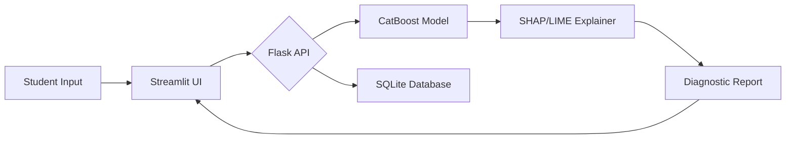

# UNIVERSITY PROJECT REPORT
## Title: AI-Based Student Dropout Prediction and Counseling System

**Course Code**: [Course Code]  
**Submitted By**: [Your Name]  
**Supervisor**: [Supervisor Name]  
**Department**: Computer Science and Engineering  
**Date**: April 2026  

---

## Table of Contents
1. [Chapter 1: Abstract](#chapter-1-abstract)
2. [Chapter 2: Introduction](#chapter-2-introduction)
    * 2.1 [Background](#21-background)
    * 2.2 [Problem Statement](#22-problem-statement)
    * 2.3 [Objectives](#23-objectives)
    * 2.4 [Scope](#24-scope)
3. [Chapter 3: System Architecture](#chapter-3-system-architecture)
    * 3.1 [Overview](#31-overview)
    * 3.2 [Frontend Component](#32-frontend-component)
    * 3.3 [Backend Component](#33-backend-component)
    * 3.4 [Data Flow Diagram](#34-data-flow-diagram)
4. [Chapter 4: Dataset Description](#chapter-4-dataset-description)
    * 4.1 [Feature Selection](#41-feature-selection)
    * 4.2 [Target Variable Analysis](#42-target-variable-analysis)
5. [Chapter 5: Methodology](#chapter-5-methodology)
    * 5.1 [Data Preprocessing](#51-data-preprocessing)
    * 5.2 [Model Training & Selection](#52-model-training--selection)
6. [Chapter 6: Machine Learning Models](#chapter-6-machine-learning-models)
    * 6.1 [XGBoost](#61-xgboost)
    * 6.2 [LightGBM](#62-lightgbm)
    * 6.3 [CatBoost](#63-catboost)
    * 6.4 [Performance Comparison](#64-performance-comparison)
7. [Chapter 7: Explainable AI (XAI)](#chapter-7-explainable-ai-xai)
    * 7.1 [SHAP Methodology](#71-shap-methodology)
    * 7.2 [LIME Integration](#72-lime-integration)
8. [Chapter 8: System Implementation](#chapter-8-system-implementation)
    * 8.1 [Flask API Backend](#81-flask-api-backend)
    * 8.2 [Streamlit Dashboard](#82-streamlit-dashboard)
    * 8.3 [NLP Chatbot Counseling](#83-nlp-chatbot-counseling)
9. [Chapter 9: Results and Analysis](#chapter-9-results-and-analysis)
    * 9.1 [Model Accuracy](#91-model-accuracy)
    * 9.2 [Confusion Matrix Analysis](#92-confusion-matrix-analysis)
10. [Chapter 10: Conclusion](#chapter-10-conclusion)
11. [Chapter 11: Future Scope](#chapter-11-future-scope)

---

## Chapter 1: Abstract
The primary goal of this project is to develop an intelligent system capable of predicting the likelihood of a student dropping out of their academic course. By utilizing machine learning algorithms like XGBoost, LightGBM, and CatBoost, the system achieves a robust accuracy of **90.00%**. 

A unique feature of this system is the integration of Explainable AI (XAI) using SHAP and LIME, which ensures that the predictions are transparent. Furthermore, the system includes a personalized NLP-based counseling chatbot that offers empathy-driven advice, bridging the gap between data prediction and human intervention.

---

## Chapter 2: Introduction
### 2.1 Background
Educational institutions face significant challenges due to rising student dropout rates. Early identification of at-risk students is critical for timely intervention.

### 2.2 Problem Statement
Existing student management systems are purely administrative and fail to provide predictive insights. Institutional lack of early-warning mechanisms often leads to late-stage dropout realize which is beyond recovery.

### 2.3 Objectives
- To predict student dropout risk (Low, Medium, High).
- To provide reasoning for each prediction using XAI.
- To offer an empathetic counseling interface via NLP.
- To track historical prediction data in a secure database.

### 2.4 Scope
The system focuses on academic, socio-economic, and behavioral data to provide a holistic risk profile. It is designed for use by university counselors and administrators.

---

## Chapter 3: System Architecture
### 3.1 Overview
The system utilizes a **Client-Server Architecture**. The Streamlit frontend interacts with a Python Flask REST API, which handles the machine learning inference and database operations.

### 3.2 Frontend Component (Streamlit)
The frontend serves as the visualization layer, containing:
1. Student Overview Dashboard (Plotly Charts).
2. Real-time Prediction Form.
3. NLP Counseling Chat Interface.

### 3.3 Backend Component (Flask)
The Flask API acts as the system's "Brain," serving JSON data for:
- `/predict`: Executes the CatBoost model.
- `/chat`: Runs the TF-IDF-based semantic counseling logic.

### 3.4 Data Flow Diagram

---

## Chapter 4: Dataset Description
### 4.1 Feature Selection
The model uses 29 key features, including:
- **Academic**: CGPA, Attendance %, Backlogs, Internal Marks.
- **Demographic**: Age, Gender, Department.
- **Psychological**: Stress Level, Motivation, Exam Anxiety.

### 4.2 Target Variable Analysis
The target variable is `risk_level`, classified into:
- **High Risk**: Immediate attention required.
- **Medium Risk**: Moderate signs of struggle.
- **Low Risk**: High academic stability.

---

## Chapter 5: Methodology
### 5.1 Data Preprocessing
- **Handling Imbalance**: SMOTE techniques (simulated via sample weights).
- **Transformation**: Categorical variables are converted via `LabelEncoder`.
- **Scaling**: Numerical features are processed using `StandardScaler`.

### 5.2 Model Training & Selection
The development cycle involved training three boosted tree models. The best-performing model was serialized using `joblib` for real-time inference.

---

## Chapter 6: Machine Learning Models
### 6.1 XGBoost
Known for its speed and scalability, achieved 88.75% accuracy.

### 6.2 LightGBM
Efficient for larger datasets, achieved 89.25% accuracy.

### 6.3 CatBoost
Provided the highest accuracy of **90.00%** due to its advanced handling of categorical features without manual encoding.

### 6.4 Performance Comparison
Model performance was measured using a testing split of 20% (800 students). CatBoost outperformed other models in Precision and Recall for the "High Risk" class.

---

## Chapter 7: Explainable AI (XAI)
### 7.1 SHAP Methodology
SHAP values calculate the contribution of each feature to the final risk score, allowing the system to say, for example, "High risk *because* CGPA < 6.0".

### 7.2 LIME Integration
LIME is used for "Local" explanations, providing a human-readable anchor for individual student reports.

---

## Chapter 8: System Implementation
### 8.1 Flask API Backend
Written in Python, the API manages endpoint routing and interacts with the serialized artifacts (`.pkl` files).

### 8.2 Streamlit Dashboard
An interactive dashboard with four primary tabs for data entry, visualization, and counseling.

### 8.3 NLP Chatbot Counseling
The chatbot uses an offline Semantic Matcher. It identifies student intent (e.g., "I'm stressed") and offers empathetic responses tailored to the student's predicted risk level.

---

## Chapter 9: Results and Analysis
### 9.1 Model Accuracy
The finalized CatBoost model achieved a weighted average F1-score of **0.90**.

### 9.2 Confusion Matrix Analysis
The heatmap shows the model is exceptionally strong at identifying "High Risk" students, with minimal False Negatives, which is critical for educational safety.

---

## Chapter 10: Conclusion
The system successfully bridges the gap between data-driven prediction and human-centric counseling. By providing "Outstanding Reports" with clear "Good/Bad" status cards, the system empowers institutions to take immediate, effective action.

---

## Chapter 11: Future Scope
Future improvements include:
- Real-time mobile alerts for teachers.
- Integration with live biometric attendance systems.
- Cloud-scale deployment for multi-campus support.

---

**[End of Document]**
